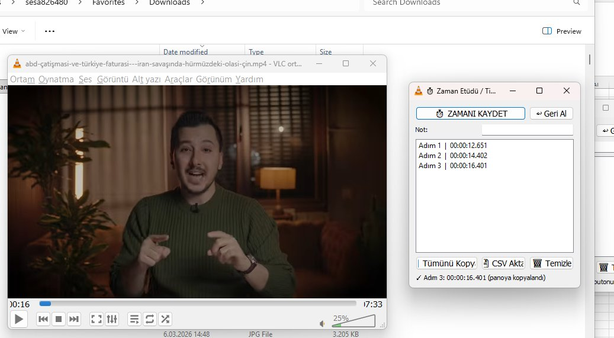

# ⏱ VLC Zaman Etüdü / VLC Time Study Extension

> VLC Media Player üzerinde çalışan, video tabanlı zaman analizi (time study) eklentisi. Üretim hattı, montaj süreci veya herhangi bir video analizinde tek tuşla zaman damgası yakalayıp Excel'e aktarmanızı sağlar.

> A VLC Media Player Lua extension for video-based time study analysis. Capture timestamps with one click and export to Excel — ideal for manufacturing, assembly line analysis, and industrial engineering.



---

## 🇹🇷 Türkçe

### Neden Bu Eklenti?

Fabrikalarda zaman etüdü yapılırken klasik yöntem şudur:
1. VLC'de videoyu izle
2. Videoyu durdur
3. Saati göz ile oku
4. Excel'e elle yaz

**Bu yöntem yavaş, hata yapıya açık ve verimsizdir.**

Bu eklenti ile:
- Tek butonla zamanı yakala
- Otomatik panoya kopyala (Ctrl+V ile Excel'e yapıştır)
- Adım adım not ekle
- Toplu olarak CSV'ye aktar veya panoya kopyala

### Kurulum

1. **Dosyayı indir:** Bu repodan `zaman_etudu.lua` dosyasını indir
2. **VLC eklenti klasörüne kopyala:**
   ```
   %APPDATA%\vlc\lua\extensions\
   ```
   > 💡 Windows'ta `Win+R` tuşlayıp `%APPDATA%\vlc` yazarak klasöre ulaşabilirsin.
   >
   > Eğer `lua` ve `extensions` klasörleri yoksa kendin oluştur:
   > `vlc\lua\extensions\`

3. **VLC'yi yeniden başlat**

### Şirket Bilgisayarlarına Kurulum (Corporate PC)

Şirket bilgisayarlarında admin yetkisi olmayabilir. Aşağıdaki adımları takip edin:

**Adım 1 — Dosyayı indirin:**

GitHub'dan `zaman_etudu.lua` dosyasını indirin. Yeşil **Code** butonuna değil, doğrudan `zaman_etudu.lua` dosyasına tıklayıp **Raw** → sağ tık → **Farklı Kaydet** yapın.

**Adım 2 — VLC klasörünü bulun:**

`Win+R` tuşlayıp şunu yapıştırın:
```
%APPDATA%\vlc
```
Genelde şu yola açılır:
```
C:\Users\SICIL_NO\AppData\Roaming\vlc\
```
> ⚠️ Şirket PC'lerinde kullanıcı adı sicil numaranız olabilir (örnek: `sesa826480`).

**Adım 3 — Klasörleri oluşturun:**

`vlc` klasörünün içinde `lua` klasörü yoksa elle oluşturun:
1. Sağ tık → **Yeni** → **Klasör** → `lua`
2. `lua` içine girin → **Yeni** → **Klasör** → `extensions`

Sonuç:
```
C:\Users\SICIL_NO\AppData\Roaming\vlc\lua\extensions\
```

**Adım 4 — Dosyayı kopyalayın:**

`zaman_etudu.lua` dosyasını `extensions` klasörüne yapıştırın:
```
C:\Users\SICIL_NO\AppData\Roaming\vlc\lua\extensions\zaman_etudu.lua
```

**Adım 5 — VLC'yi yeniden başlatın:**

VLC'yi kapatıp tekrar açın. **Görünüm** menüsünde **Zaman Etüdü / Time Study** seçeneği görünecektir.

> 💡 **Not:** `AppData` klasörü gizli olabilir. Dosya Gezgini'nde **Görünüm → Gizli öğeler** seçeneğini açın veya `Win+R` ile doğrudan `%APPDATA%\vlc` yazarak ulaşın.
>
> 💡 **Toplu dağıtım:** IT ekibiniz bu dosyayı GPO ile veya paylaşılan ağ klasöründen tüm kullanıcılara dağıtabilir. Hedef klasör: `%APPDATA%\vlc\lua\extensions\`

### Kullanım

1. VLC'yi aç, videoyu oynat
2. Menüden **Görünüm → Zaman Etüdü / Time Study** seç
3. Küçük bir pencere açılır:

| Buton | İşlev |
|-------|-------|
| ⏱ **ZAMANI KAYDET** | O anki video zamanını yakalar, panoya kopyalar |
| ↩ **Geri Al** | Son kaydı siler |
| **Not** alanı | Adıma açıklama ekler (opsiyonel) |
| 📋 **Tümünü Kopyala** | Tüm kayıtları TAB-separated olarak panoya kopyalar |
| 💾 **CSV Aktar** | Masaüstüne CSV dosyası kaydeder |
| 🗑 **Temizle** | Tüm kayıtları siler |

### Excel'e Aktarma

**Yöntem 1 — Tek tek:**
Her "Zamanı Kaydet" basımında zaman otomatik panoya kopyalanır. Excel hücresine `Ctrl+V` yapıştır.

**Yöntem 2 — Toplu:**
"Tümünü Kopyala" butonuna bas → Excel'de `Ctrl+V` yap → Adım, Zaman, Saniye, Not sütunlarına otomatik oturur.

**Yöntem 3 — CSV:**
"CSV Aktar" → Masaüstünde `zaman_etudu_YYYYMMDD_HHMMSS.csv` oluşur → Excel ile aç.

### Dosya Yolu (Windows)

```
C:\Users\KULLANICI_ADINIZ\AppData\Roaming\vlc\lua\extensions\zaman_etudu.lua
```

---

## 🇬🇧 English

### Why This Extension?

In manufacturing environments, traditional time study with video involves:
1. Watch video in VLC
2. Pause at the right moment
3. Read the timestamp visually
4. Manually type it into Excel

**This is slow, error-prone, and inefficient.**

This extension provides:
- One-click timestamp capture
- Automatic clipboard copy (Ctrl+V into Excel)
- Optional notes per step
- Bulk export to CSV or clipboard

### Installation

1. **Download** `zaman_etudu.lua` from this repository
2. **Copy to VLC extensions folder:**

   **Windows:**
   ```
   %APPDATA%\vlc\lua\extensions\
   ```

   **macOS:**
   ```
   /Users/USERNAME/Library/Application Support/org.videolan.vlc/lua/extensions/
   ```

   **Linux:**
   ```
   ~/.local/share/vlc/lua/extensions/
   ```

   > Create the `lua/extensions/` folders if they don't exist.

3. **Restart VLC**

### Usage

1. Open VLC and play a video
2. Go to **View → Zaman Etüdü / Time Study**
3. A dialog window opens:

| Button | Function |
|--------|----------|
| ⏱ **ZAMANI KAYDET** | Captures current timestamp, copies to clipboard |
| ↩ **Geri Al** | Undo last entry |
| **Not** field | Add a note/description to the step (optional) |
| 📋 **Tümünü Kopyala** | Copy all records to clipboard (TAB-separated) |
| 💾 **CSV Aktar** | Export all records as CSV to Desktop |
| 🗑 **Temizle** | Clear all records |

### Export to Excel

- **One by one:** Each capture auto-copies to clipboard → `Ctrl+V` in Excel
- **Bulk:** Click "Tümünü Kopyala" → `Ctrl+V` in Excel → columns auto-align
- **CSV:** Click "CSV Aktar" → opens as `zaman_etudu_YYYYMMDD_HHMMSS.csv` on Desktop

---

## 📁 Repository Structure

```
vlc-time-study/
├── zaman_etudu.lua      # Main extension file
├── README.md             # This file
├── LICENSE               # MIT License
└── screenshots/
    └── demo.png          # Demo screenshot
```

## ⚙️ Requirements

- VLC Media Player 3.x or later
- Windows (clipboard feature uses `clip.exe`)
  - macOS/Linux: clipboard copy won't work out of the box, but CSV export works fine

## 📄 License

MIT License — see [LICENSE](LICENSE)

## 👤 Author

**Ahmet Mersin**
- Web: [ahmetmersin.com](https://ahmetmersin.com)
- GitHub: [@iwallplace](https://github.com/iwallplace)
- LinkedIn: [/in/ahmetmersin](https://linkedin.com/in/ahmetmersin)
